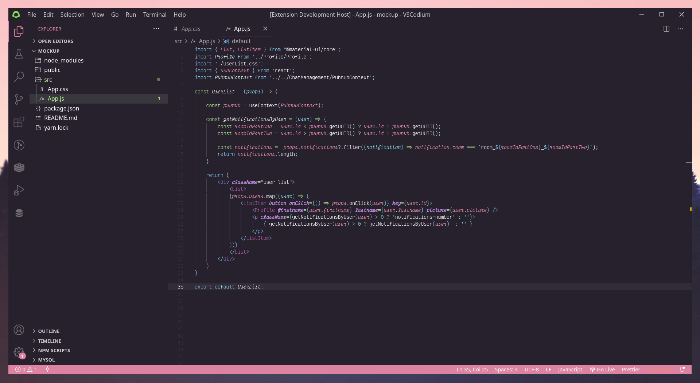
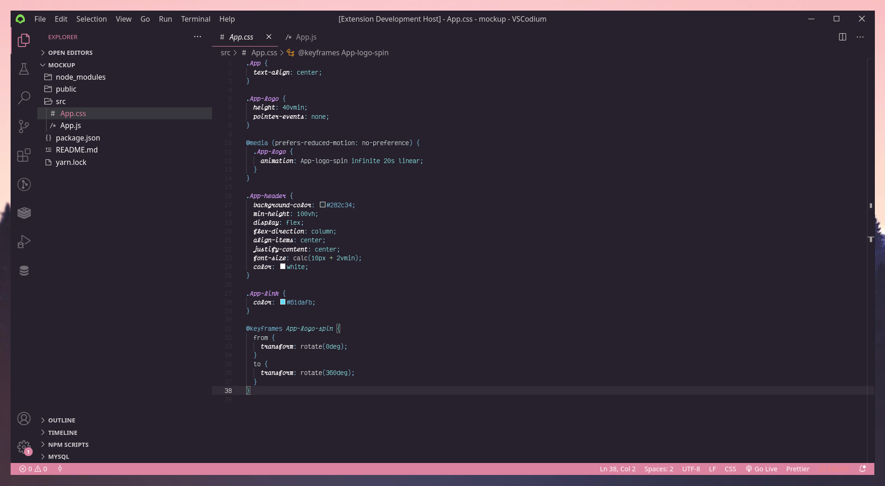

## Lightheaded - VSCode Theme 🥑 

A warm, comfy VSCode Theme, for pastel colors lovers. 🤍

### Preview 






### Settings

- Note that you may be required to change the settings of your title bar native style (in your VSCode settings - settings.json). <br />

 ``` 
    "window.titleBarStyle": "custom"
 ``` 

- Font used : Victor Mono
- Icons Pack used : Chalice
